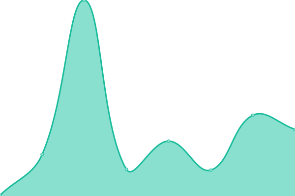
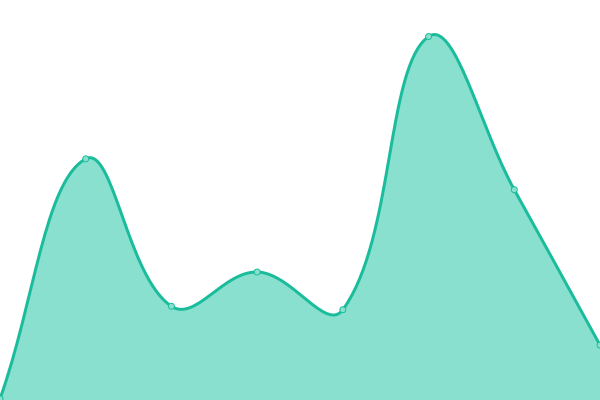
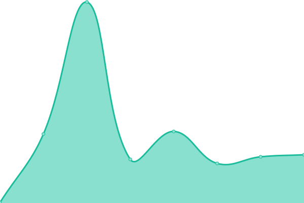

# [📈 Live Status](https://status.helflix.app): <!--live status--> **🟧 Partial outage**

This repository contains the open-source uptime monitor and status page for [HalianElf](https://status.helflix.app), powered by [Upptime](https://github.com/upptime/upptime).

With [Upptime](https://upptime.js.org), you can get your own unlimited and free uptime monitor and status page, powered entirely by a GitHub repository. We use [Issues](https://github.com/HalianElf/upptime/issues) as incident reports, [Actions](https://github.com/HalianElf/upptime/actions) as uptime monitors, and [Pages](https://status.helflix.app) for the status page.

<!--start: status pages-->
<!-- This summary is generated by Upptime (https://github.com/upptime/upptime) -->
<!-- Do not edit this manually, your changes will be overwritten -->
<!-- prettier-ignore -->
| URL | Status | History | Response Time | Uptime |
| --- | ------ | ------- | ------------- | ------ |
|  [Helflix](https://helflix.app) | 🟩 Up | [helflix.yml](https://github.com/HalianElf/upptime/commits/HEAD/history/helflix.yml) | 

 329ms
     
 | 

<a href="https://status.helflix.app/history/helflix">100.00%</a>
    

|  [Plex](https://helflix.app/plex/web/index.html) | 🟩 Up | [plex.yml](https://github.com/HalianElf/upptime/commits/HEAD/history/plex.yml) | 

 124ms
     
 | 

<a href="https://status.helflix.app/history/plex">100.00%</a>
    

|  [Bitwarden](https://bitwarden.helflix.app) | 🟩 Up | [bitwarden.yml](https://github.com/HalianElf/upptime/commits/HEAD/history/bitwarden.yml) | 

 184ms
     
 | 

<a href="https://status.helflix.app/history/bitwarden">100.00%</a>
    

|  [FileBrowser](https://files.helflix.app) | 🟥 Down | [file-browser.yml](https://github.com/HalianElf/upptime/commits/HEAD/history/file-browser.yml) | 

 195ms
     
 | 

<a href="https://status.helflix.app/history/file-browser">99.53%</a>
    

|  [Gitea](https://gitea.helflix.app) | 🟩 Up | [gitea.yml](https://github.com/HalianElf/upptime/commits/HEAD/history/gitea.yml) | 

 210ms
     
 | 

<a href="https://status.helflix.app/history/gitea">100.00%</a>
    

|  [Grafana](https://grafana.helflix.app) | 🟩 Up | [grafana.yml](https://github.com/HalianElf/upptime/commits/HEAD/history/grafana.yml) | 

 237ms
     
 | 

<a href="https://status.helflix.app/history/grafana">100.00%</a>
    

|  [Tautulli](https://helflix.app/tautulli/status) | 🟩 Up | [tautulli.yml](https://github.com/HalianElf/upptime/commits/HEAD/history/tautulli.yml) | 

 298ms
     
 | 

<a href="https://status.helflix.app/history/tautulli">100.00%</a>
    

|  [Ombi](https://helflix.app/ombi/) | 🟩 Up | [ombi.yml](https://github.com/HalianElf/upptime/commits/HEAD/history/ombi.yml) | 

 143ms
     
 | 

<a href="https://status.helflix.app/history/ombi">100.00%</a>
    

|  [Sonarr](https://helflix.app/sonarr/) | 🟩 Up | [sonarr.yml](https://github.com/HalianElf/upptime/commits/HEAD/history/sonarr.yml) | 

 186ms
     
 | 

<a href="https://status.helflix.app/history/sonarr">100.00%</a>
    

|  [Radarr](https://helflix.app/radarr/) | 🟩 Up | [radarr.yml](https://github.com/HalianElf/upptime/commits/HEAD/history/radarr.yml) | 

 130ms
     
 | 

<a href="https://status.helflix.app/history/radarr">100.00%</a>
    

|  [Lidarr](https://helflix.app/lidarr/) | 🟩 Up | [lidarr.yml](https://github.com/HalianElf/upptime/commits/HEAD/history/lidarr.yml) | 

 142ms
     
 | 

<a href="https://status.helflix.app/history/lidarr">100.00%</a>
    

|  [Bazarr](https://helflix.app/bazarr/) | 🟩 Up | [bazarr.yml](https://github.com/HalianElf/upptime/commits/HEAD/history/bazarr.yml) | 

 281ms
     
 | 

<a href="https://status.helflix.app/history/bazarr">100.00%</a>
    

|  [SABnzbd](https://helflix.app/sabnzbd/) | 🟩 Up | [sa-bnzbd.yml](https://github.com/HalianElf/upptime/commits/HEAD/history/sa-bnzbd.yml) | 

 264ms
     
 | 

<a href="https://status.helflix.app/history/sa-bnzbd">100.00%</a>
    

|  [NZBHydra](https://helflix.app/nzbhydra/) | 🟩 Up | [nzb-hydra.yml](https://github.com/HalianElf/upptime/commits/HEAD/history/nzb-hydra.yml) | 

 145ms
     
 | 

<a href="https://status.helflix.app/history/nzb-hydra">100.00%</a>
    

|  [Deluge](https://helflix.app/deluge/) | 🟩 Up | [deluge.yml](https://github.com/HalianElf/upptime/commits/HEAD/history/deluge.yml) | 

 192ms
     
 | 

<a href="https://status.helflix.app/history/deluge">100.00%</a>
    

|  [Jackett](https://helflix.app/jackett/UI/Login) | 🟩 Up | [jackett.yml](https://github.com/HalianElf/upptime/commits/HEAD/history/jackett.yml) | 

 128ms
     
 | 

<a href="https://status.helflix.app/history/jackett">100.00%</a>
    

<!--end: status pages-->

[**Visit our status website →**](https://status.helflix.app)

## 📄 License

- Powered by: [Upptime](https://github.com/upptime/upptime)
- Code: [MIT](./LICENSE) © [HalianElf](https://status.helflix.app)
- Data in the `./history` directory: [Open Database License](https://opendatacommons.org/licenses/odbl/1-0/)
